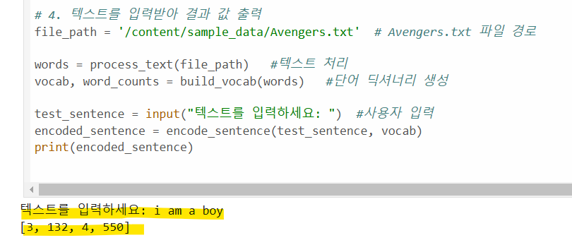
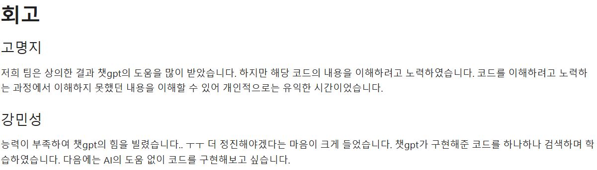

# AIFFEL Campus Online Code Peer Review Templete
- 코더 : 강민성
- 리뷰어 : 채남병


# PRT(Peer Review Template)
- [Y]  **1. 주어진 문제를 해결하는 완성된 코드가 제출되었나요?**
    - 전체 코드와 테스트 결과물이 제출됨
    - 
      
- [Y]  **2. 전체 코드에서 가장 핵심적이거나 가장 복잡하고 이해하기 어려운 부분에 작성된 
주석 또는 doc string을 보고 해당 코드가 잘 이해되었나요?**
    - 각 단계별로 함수를 생성하여 작성함으로 선행/후행 업무를 알 수 있었습니다.  
         
- [Y]  **3. 에러가 난 부분을 디버깅하여 문제를 해결한 기록을 남겼거나
새로운 시도 또는 추가 실험을 수행해봤나요?**
    - 결과물에서는 에러가 난 부분을 보여주지 않으므로 디버깅에 대한 시도를 알 수 없음
        
- [Y]  **4. 회고를 잘 작성했나요?**
    - 리뷰에 대한 설명을 구두로 해주셔서 회고 내용을 충분히 전달 받을 수 있었습니다. 
    -  
        
- [N]  **5. 코드가 간결하고 효율적인가요?**
    - 작성한 코드를 이해할 수 있지만, 제가 평가하기 어려운 수준으로 프로그래밍이 되어 있어서, 효율적 여부에 대해서는 점수를 부여하지 못하겠습니다. 

# 회고(참고 링크 및 코드 개선)
```
# 내재함수 이외에 def 의 형식으로 함수를 만들어서 사용함이 인상 깊었습니다. 
# 인공지능의 도움을 받은 코딩의 경우, 개발자가 충분히 이해하고 적용하는 것이 필요하다고 봅니다. 

```
